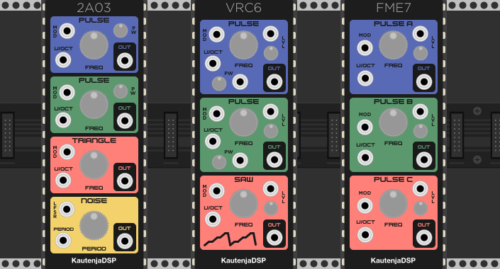
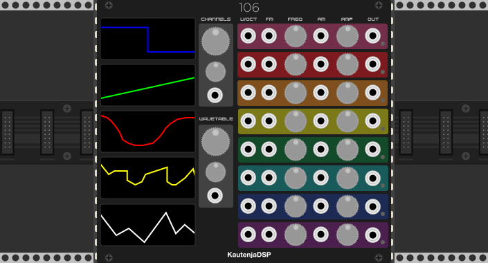
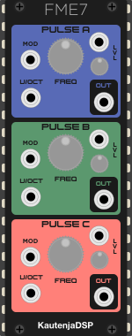

# Potato Chips

[![Travis CI Build Status][BuildStatus]][BuildServer]

[BuildStatus]:  https://travis-ci.org/Kautenja/PotatoChips.svg?branch=master
[BuildServer]:  https://travis-ci.org/Kautenja/PotatoChips

These retro sound chips are so good,
[I eat 'em like they're potato chips.][sam-hyde]
They're just so addicting.

[sam-hyde]: https://www.youtube.com/watch?v=lL5M-vXq58c

## 2A03

2A03 is an emulation of the Ricoh 2A03 audio processing unit from the Nintendo
Entertainment System (NES) for VCV Rack. The 2A03 chip contains two pulse wave
generators, a quantized triangle wave generator, and a noise generator. The
original chip featured a DMC loader for playing samples that has been omitted
in this emulation.

### Features

-   **Dual pulse wave generator:** Dual 8-bit pulse waves with four duty
    cycles: _12.5%_, _25%_, _50%_, and _75%_
-   **Quantized triangle wave generator:** Generate NES style triangle wave
    with 16 steps of quantization
-   **Noise generator:** generate pseudo-random numbers at 16 different
    frequencies
-   **Linear Feedback Shift Register (LFSR):** old-school 8-bit randomness!

See the [Manual](manual/2A03.pdf) for more
information about the features of this module.

## VRC6

VRC6 is an emulation of the Konami VRC6 audio processing unit from the
Nintendo Entertainment System (NES) for VCV Rack. The VRC6 chip contains two
pulse wave generators, and a quantized saw wave generator.

### Features

-   **Dual pulse wave generator:** Dual 8-bit pulse waves with eight duty
    cycles: _6.25%_, _12.5%_, _18.75%_, _25%_, _31.25%_, _37.5%_, _43.75%_, and
    _50%_
-   **Quantized saw wave generator:** Generate NES style saw wave with variable
    quantization including the overflow bug in the VRC6
-   **Amplitude modulation:** Manual and CV control over the individual voice
    levels

See the [Manual](manual/VRC6.pdf) for more
information about the features of this module.

## FME7

FME7 is an emulation of the Sunsoft FME7 audio processing unit from the
Nintendo Entertainment System (NES) for VCV Rack. The FME7 chip contains three
pulse wave generators, a noise generator, and an envelope generator. Only the
pulse wave generators are implemented currently.

### Features

-   **Triple pulse wave generator:** Triple 12-bit pulse waves with duty cycle of _50%_
-   **Amplitude modulation:** Manual and CV control over the individual voice levels

See the [Manual](manual/FME7.pdf) for more
information about the features of this module.

## 106

106 is an emulation of the Namco 106 audio processing unit from the
Nintendo Entertainment System (NES) for VCV Rack. The Namco 106 chip contains
eight channels of wave-table synthesis and 128 bytes of operational RAM. The
wave-tables are 4-bit and can be as long as 63 samples. This module uses a
bank of five 32-sample wave-tables to act as the waveform for all eight
channels.

### Features

-   **Wave-table synthesis:** 8 channels of wave-table synthesis with bit depth
    of 4 bits and table size of 32 samples
-   **Waveform morph:** 5 banks of wave-tables to morph between using linear
    interpolation
-   **Amplitude modulation:** 4-bit amplifier with voltage control
-   **Namco 106 compute limitation:** activating each additional channel (up
    to 8) reduces the amount of compute available for all channels. This causes
    all channels to drop in frequency when additional channels are activated.

See the [Manual](manual/106.pdf) for
more information about the features of this module.

## Acknowledgments

The code for the module is derived from the NES synthesis library,
[Nes_Snd_Emu](https://github.com/jamesathey/Nes_Snd_Emu).
