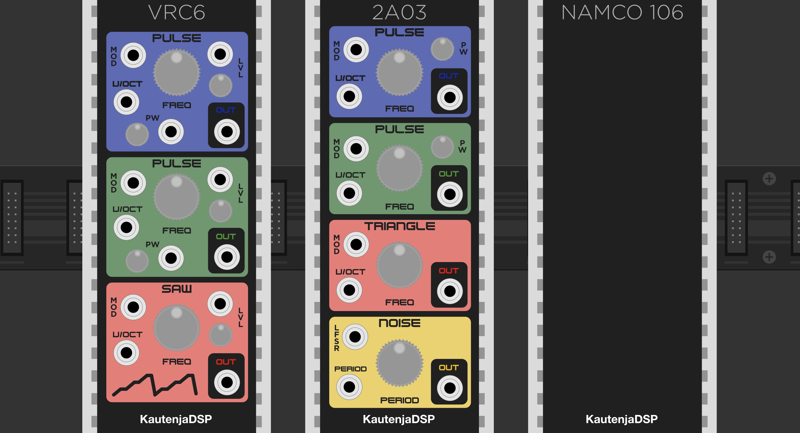
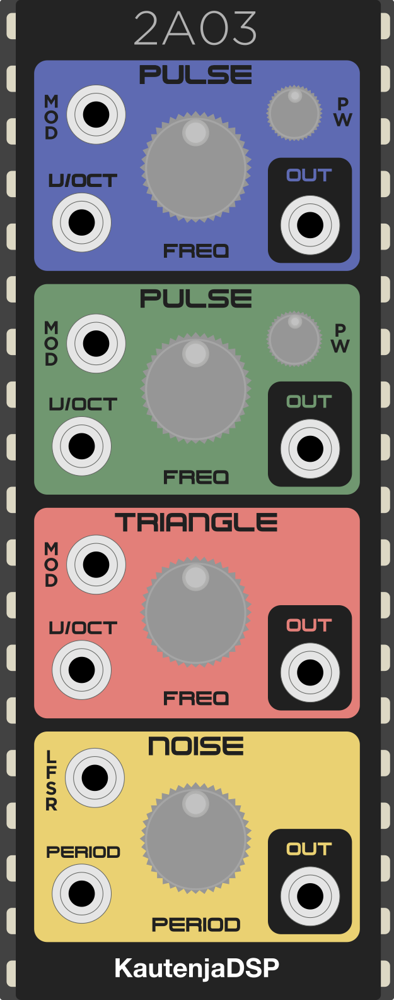
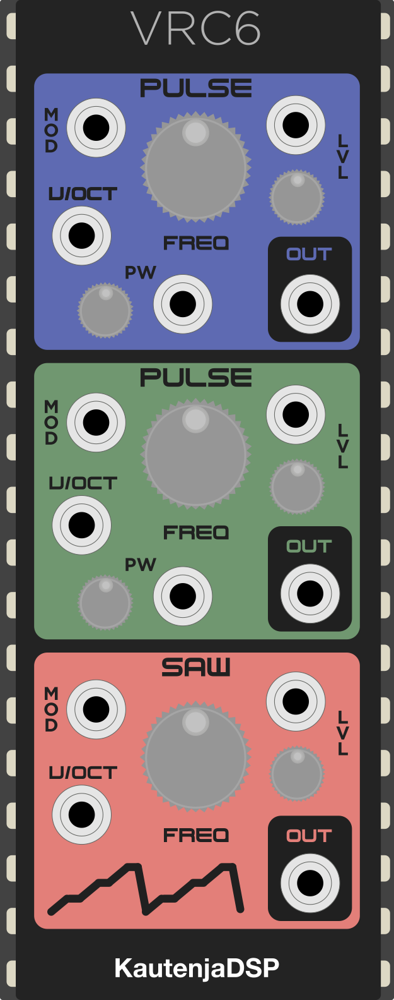
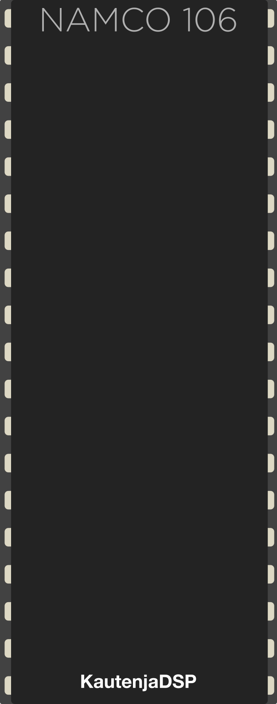

# Potato Chips

[![Travis CI Build Status][BuildStatus]][BuildServer]

[BuildStatus]:  https://travis-ci.com/Kautenja/NES-Oscillators.svg?branch=master
[BuildServer]:  https://travis-ci.com/Kautenja/NES-Oscillators

These retro sound chips are so good, [i eat em like theyre potato chips](https://www.youtube.com/watch?v=lL5M-vXq58c). They're just so addicting.

## 2A03

2A03 is an emulation of the 2A03 sound chip from the Nintendo Entertainment
System (NES) for VCV Rack. The 2A03 chip contains two pulse wave generators,
a quantized triangle wave generator, and a noise generator. The original chip
featured a DMC loader for playing samples that has been omitted in this
emulation.

### Features

-   **Dual pulse wave generator:** Dual 8-bit pulse waves with four duty
    cycles: _12.5%_, _25%_, _50%_, and _75%_
-   **Quantized triangle wave generator:** Generate NES style triangle wave
    with 16 steps of quantization
-   **Noise generator:** generate pseudo-random numbers at 16 different
    frequencies
-   **Linear Feedback Shift Register (LFSR):** old-school 8-bit randomness!

See the [Manual](https://kautenja.github.io/modules/2A03/manual.pdf) for more
information about the features of this module.

## VRC6

VRC6 is an emulation of the Konami VRC6 sound chip from the Nintendo
Entertainment System (NES) for VCV Rack. The VRC6 chip contains two pulse
wave generators, and a quantized saw wave generator.

### Features

-   **Dual pulse wave generator:** Dual 8-bit pulse waves with eight duty
    cycles: _6.25\%_, _12.5\%_, _18.75\%_, _25\%_, _31.25\%_, _37.5\%_,
    _43.75\%_, and _50\%_
-   **Quantized saw wave generator:** Generate NES style saw wave with variable
    quantization including the overflow bug in the VRC6
-   **Amplitude modulation:** Manual and CV control over the individual voice
    levels

See the [Manual](https://kautenja.github.io/modules/VRC6/manual.pdf) for more
information about the features of this module.

## Namco106

**Coming Soon!**

### Features

-   **Wavetable synthesis:** 8 channels of wavetable synthesis
-   **128 bytes RAM:** 128 bytes of RAM for runtime wavetable data

See the [Manual](https://kautenja.github.io/modules/Namco106/manual.pdf) for more
information about the features of this module.

## Acknowledgments

The code for the module is derived from the NES synthesis library,
[Nes_Snd_Emu](https://github.com/jamesathey/Nes_Snd_Emu).
