

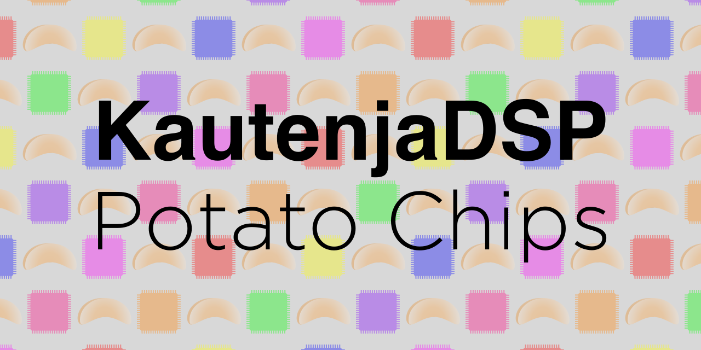

[![Travis CI Build Status][BuildStatus]][BuildServer]

[BuildStatus]:  https://travis-ci.org/Kautenja/PotatoChips.svg?branch=master
[BuildServer]:  https://travis-ci.org/Kautenja/PotatoChips

These retro sound chips are so good,
[I eat 'em like they're potato chips.][SamHyde-PotatoChips]
They're just so addicting!

[SamHyde-PotatoChips]: https://www.youtube.com/watch?v=lL5M-vXq58c

<!-- ------------------------------------------------------------ -->
<!-- MARK: Buzzy Beetle -->
<!-- ------------------------------------------------------------ -->

## Buzzy Beetle

**Buzzy Beetle** is an emulation of the [Ricoh 2A03][Ricoh2A03] audio
processing unit from the [Nintendo Entertainment System (NES)][NES].
The 2A03 chip contains two pulse wave generators, a quantized triangle wave
generator, and a noise generator. The original chip featured a DMC loader for
playing samples that has been omitted in this emulation.

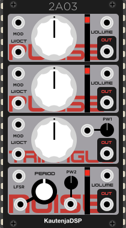

### Features

-   **Dual pulse wave generator:** Dual 8-bit pulse waves with four duty
    cycles: _12.5%_, _25%_, _50%_, and _75%_
-   **Quantized triangle wave generator:** Generate NES style triangle wave
    with 16 steps of quantization
-   **Noise generator:** generate pseudo-random numbers at 16 different
    frequencies
-   **Linear Feedback Shift Register (LFSR):** old-school 8-bit randomness!

See the [Manual][2A03] for more information about the features of this module.

<!-- ------------------------------------------------------------ -->
<!-- MARK: Name Corp Octal Wave Generator -->
<!-- ------------------------------------------------------------ -->

## Name Corp Octal Wave Generator

**Name Corp Octal Wave Generator** is an emulation of the [Namco 106][Namco106]
audio processing unit from the [Nintendo Entertainment System (NES)][NES].
The Namco 106 chip contains eight channels of wave-table synthesis and 128
bytes of operational RAM. The wave-tables are 4-bit and can be as long as 63
samples. This module uses a bank of five 32-sample wave-tables to act as the
waveform for all eight channels.

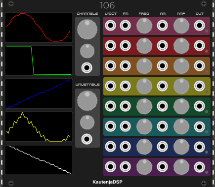

### Features

-   **Wave-table synthesis:** 8 channels of wave-table synthesis with bit depth
    of 4 bits and table size of 32 samples
-   **Waveform morph:** 5 banks of wave-tables to morph between using 32-bit
    floating point linear interpolation (not very retro, but it sounds nice)
-   **Frequency control:** 18-bit frequency control with linear frequency modulation
-   **Amplitude modulation:** 4-bit amplifier with linear amplitude modulation
-   **Namco 106 compute limitation:** activating each additional channel (up
    to 8) reduces the amount of compute available for all channels. This causes
    all channels to drop in frequency when additional channels are activated.

See the [Manual][106] for more information about the features of this module.

<!-- ------------------------------------------------------------ -->
<!-- MARK: Gleeokillator -->
<!-- ------------------------------------------------------------ -->

## Gleeokillator

**Gleeokillator** is an emulation of the [Sunsoft FME7][SunsoftFME7] audio
processing unit from the [Nintendo Entertainment System (NES)][NES]. The FME7
chip contains three pulse wave generators, a noise generator, and an envelope
generator. Only the pulse wave generators are implemented currently.

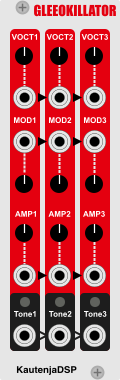

### Features

-   **Triple pulse wave generator:** Triple 12-bit pulse waves with duty cycle of _50%_
-   **Amplitude modulation:** Manual and CV control over the individual voice levels

See the [Manual][Gleeokillator] for more information about the features of this module.

<!-- ------------------------------------------------------------ -->
<!-- MARK: Escillator -->
<!-- ------------------------------------------------------------ -->

## Escillator

**Escillator** is an emulation of the [Konami VRC6][KonamiVRC6] audio
processing unit from the [Nintendo Entertainment System (NES)][NES]. The VRC6
chip contains two pulse wave generators, and a quantized saw wave generator.

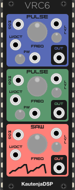

### Features

-   **Dual pulse wave generator:** Dual 8-bit pulse waves with eight duty
    cycles: _6.25%_, _12.5%_, _18.75%_, _25%_, _31.25%_, _37.5%_, _43.75%_, and
    _50%_
-   **Quantized saw wave generator:** Generate NES style saw wave with variable
    quantization including the overflow bug in the VRC6
-   **Amplitude modulation:** Manual and CV control over the individual voice
    levels

See the [Manual][VRC6] for more information about the features of this module.

<!-- ------------------------------------------------------------ -->
<!-- MARK: Pallet Town Waves System -->
<!-- ------------------------------------------------------------ -->

## Pallet Town Waves System

**Pallet Town Waves System** is an emulation of the
[Nintendo GameBoy Sound System (GBS)](https://gbdev.gg8.se/wiki/articles/Gameboy_sound_hardware)
audio processing
unit. The GBS is similar to the Ricoh 2A03, but replaces the triangle waveform
generator with a wave-table synthesizer.

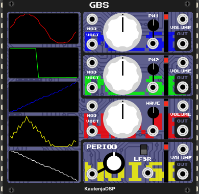

### Features

-   **Dual pulse wave generator:** Dual 8-bit pulse waves with four duty
    cycles: _12.5%_, _25%_, _50%_, and _75%_
-   **Wave-table synthesis channel:** wave-table synthesis with bit depth
    of 4 bits and table size of 32 samples. 5 pages of wave-tables can be
    interpolated between using CV
-   **Noise generator:** generate pseudo-random numbers at 7 different
    frequencies
-   **Linear Feedback Shift Register (LFSR):** old-school 8-bit randomness!

See the [Manual][GBS] for more information about the features of this module.

<!-- ------------------------------------------------------------ -->
<!-- MARK: S-SMP(ADSR) -->
<!-- ------------------------------------------------------------ -->

## S-SMP(ADSR)

S-SMP(ADSR) is an emulation of the ADSR from the Sony S-SMP audio processing
unit in the [Super Nintendo Entertainment System (SNES)][SNES]. The envelope
generator has three stages, (1) an attack stage that ramps up linearly to the
total level, (2) a decay stage that ramps down exponentially to a sustain
level, and (3) a sustain/release stage that ramps down exponentially from the
sustain level to zero.

S-SMP(ADSR) provides the key features of the ADSR envelope generator of the
S-SMP chip, namely,
-   **_32KHz_ Sample Rate:** The S-SMP was designed to run at _32kHz_, so the
    audio inputs and outputs of the module are locked to _32kHz_.
-   **Stereo Processing:** Two envelope generators on one module for
    stereo modulation, cross modulation, or both!
-   **Total Level Control:** Control over the overall level of the envelope
    generator, including inversion for ducking effects.
-   **Stage Length Control:** Control over stage timings using sliders and
    control voltages.

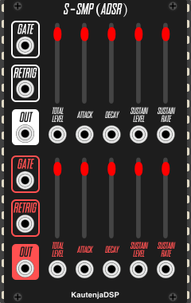

### Features

See the [Manual][S_SMP_ADSR] for more information about the features of this module.

<!-- ------------------------------------------------------------ -->
<!-- MARK: S-SMP(BRR) -->
<!-- ------------------------------------------------------------ -->

## S-SMP(BRR)

S-SMP(BRR) is an emulation of the Bit-Rate Reduction (BRR) sample playback
engine from the Sony S-SMP audio processing unit in the
[Super Nintendo Entertainment System (SNES)][SNES]. The sample playback engine
has a compression ratio of _32:9_ over standard 16-bit PCM, and includes a
reconstruction filter.

S-SMP(BRR) provides the key features of the BRR sample playback engine of the
S-SMP chip, namely,
-   **_32KHz_ Sample Rate:** The S-SMP was designed to run at _32kHz_, so the
    audio inputs and outputs of the module are locked to _32kHz_.
-   **Multi-channel Processing:** 8 different mono sample playback channels.
-   **Stereo Panning:** Split mono samples into the stereo field and introduce
    surround sound effects.
-   **Reconstruction Filter:** Four-mode reconstruction filter including a
    bypass mode and three low-pass filter modes.

### Features

See the [Manual][S_SMP_BRR] for more information about the features of this module.

<!-- ------------------------------------------------------------ -->
<!-- MARK: S-SMP(Echo) -->
<!-- ------------------------------------------------------------ -->

## S-SMP(Echo)

S-SMP(Echo) is a Eurorack module that emulates the echo effect from the S-SMP
sound chip on the [Super Nintendo Entertainment System (SNES)][SNES].The Echo
effect of the S-SMP chip has _15_ different delay levels of _16ms_ each, a
_64KB_ echo buffer, an 8-tap FIR filter for shaping the sound of the echo,
parameterized feedback, and parameterized dry / wet mix level. The echo buffer
is stereo, although the echo parameters and coefficients of the FIR filter are
the same for both channels.

S-SMP(Echo) provides the key features of the echo module of the S-SMP chip,
namely,
-   **_32KHz_ Sample Rate:** The S-SMP was designed to run at _32kHz_, so the
    audio inputs and outputs of the module are locked to _32kHz_.
-   **Stereo Processing:** Echo buffer for two independent inputs in stereo
    configuration. The parameters are the same for both inputs, but the inputs
    have their own dedicated echo buffers.
-   **Expanded Delay:** The 15 levels of delay has been upgraded to 31 levels
    that each add an additional _16ms_ of delay (up to roughly _500ms_). 31
    levels of delay is able to fit in the RAM of the original S-SMP, but the
    instruction set does not normally support the addressing of 31 levels.
-   **Feedback:** Additive and subtractive feedback following the original
    implementation
-   **Surround Effect:** Stereo mixer with the ability to invert the phase of
    either channel resulting in odd Haas effects.
-   **8-tap FIR Filter:** Fully parameterized 8-tap FIR filter for shaping the
    sound of the echo. The filter can be parameterized as low-pass, high-pass,
    band-pass, band-stop, etc. and includes presets with filter parameters from
    popular SNES games.

### Features

See the [Manual][S_SMP_Echo] for more information about the features of this module.

<!-- ------------------------------------------------------------ -->
<!-- MARK: S-SMP-Gauss -->
<!-- ------------------------------------------------------------ -->

## S-SMP(Gauss)

S-SMP(Gauss) is an emulation of the BRR filter & Gaussian interpolation filter
from the Sony S-SMP audio processing unit in the
[Super Nintendo Entertainment System (SNES)][SNES]. The four BRR filter modes
were applied to BRR sample blocks on the SNES and the Gaussian interpolation
filter was applied to output audio and removed high-frequency content from the
signal.

S-SMP(Gauss) provides the key features of the BRR filter and Gaussian filter
of the S-SMP chip, namely,
-   **_32KHz_ Sample Rate:** The S-SMP was designed to run at _32kHz_, so the
    audio inputs and outputs of the module are locked to _32kHz_.
-   **Stereo Processing:** Dual processing channels for stereo effects or other
    create multi-tracking applications.
-   **4 BRR Filter Modes:** 4 filter modes from the BRR sample playback engine
    that act as low-pass filters.
-   **Gaussian Interpolation Filter:** A filter that removes high-frequency
    content and adds subtle distortion. This filter provides the muffling
    character that fans of SNES audio will find familiar.

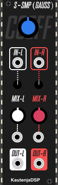

### Features

See the [Manual][S_SMP_Gauss] for more information about the features of this module.

<!-- ------------------------------------------------------------ -->
<!-- MARK: S-SMP -->
<!-- ------------------------------------------------------------ -->

## S-SMP _(Coming Soon!)_

S-SMP is an emulation of the Sony S-SMP audio processing unit from the
[Super Nintendo Entertainment System (SNES)][SNES].
The S-SMP is a complex module containing a DSP chip (the S-DSP), a CPU chip (
the SPC700), 64KB of total RAM storage, an amplifier, and a DAC.

### Features

See the [Manual][S_SMP] for more information about the features of this module.

<!-- ------------------------------------------------------------ -->
<!-- MARK: Boss Fight -->
<!-- ------------------------------------------------------------ -->

## Boss Fight

**Boss Fight** is an emulation and re-envisioning of the Yamaha
[Yamaha YM2612][YM2612] audio processing unit from the
[Sega Mega Drive & Sega Genesis][SegaMD]. Boss Fight provides the key
functionality of the 3rd channel of Yamaha YM2612, in addition to some hacks,
omissions, and re-envisioned features, namely,

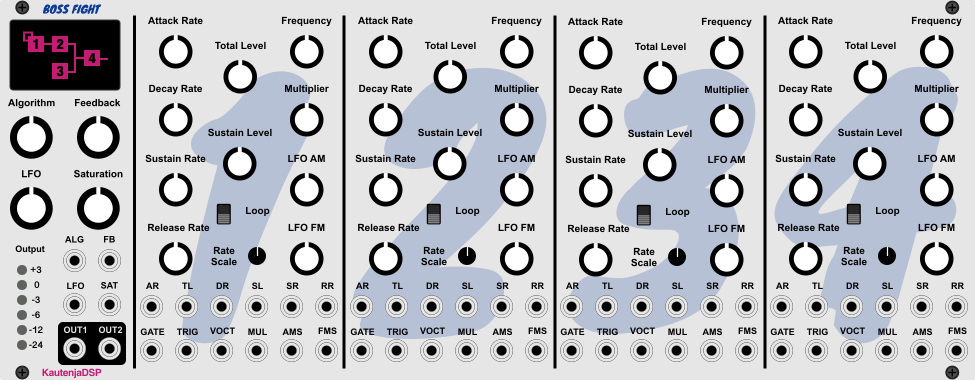

### Features

-   **16-bit Audio** It's 8 bits better than the previous generation of chips!
    This is marketing! We're actually lying though -- the YM2612 produced a
    _14-bit_ PCM stream, and so does BossFight. You're not getting those 2 bits
    back; go cry about it.
-   **4-Operator FM Synthesis** Full panel and CV control over the parameters
    for each of the four operators including envelopes, multipliers, rate
    scalings, tunings, gates, and LFO modulations.
-   **8 FM Algorithms** 8 different arrangements of the four operators
    following the original chip implementation.
-   **Operator 1 Feedback** Feedback into operator one for interesting timbres
    or total wave destruction.
-   **Individual Operator Frequencies** Control the frequency of each operator
    to produce weird, harsh, and trashed noises.
-   **Looping Envelopes** Transform the one-shot envelope generators of
    individual operators into looping AD envelopes.
-   **Aliasing Control** The YM2612 hard clips the output signal when it gets
    too loud. This is both a musically useful effect for introducing high-order
    harmonics, as well as aliasing. Nyquist lied to you, aliasing is your
    friend. However, if you are not a fan of clipping and aliasing, aliasing
    control allows you to attenuate the output signal from the chip _before_
    it passes through the hard clipper to prevent fully saturating the 14-bit
    PCM stream.
-   **VU Meter** A VU meter tracks how hot the signal from BossFight is getting
    and makes it easy to visualize how much clipping is occurring.
-   **Low-Frequency Oscillator** A shared low-frequency sine oscillator
    controls amplitude modulation and frequency modulation of each operator.
-   **Mono Output** The original YM2612 was stereo, but only because it had
    six channels of synthesis. Boss Fight is a monophonic voice so there is no
    built-in stereo processing.
-   **Semi-Modular Normalization** Inputs are normalled forward across the
    operators to reduce the amount of patch cables for setting up simple
    patches quickly.

See the [Manual][BossFight] for more information about the features of this module.

<!-- ------------------------------------------------------------ -->
<!-- MARK: Mega Tone -->
<!-- ------------------------------------------------------------ -->

## Mega Tone

**Mega Tone** is an emulation of the [Texas Instruments SN76489][TI-SN76489] audio
processing unit from the [Sega Master System][SegaMasterSystem],
[Sega Mega Drive, and Sega Genesis][SegaMD]. The SN76489 chip contains three
pulse waveform generators and an LFSR-based noise generator that selects
between pitched white-noise and static periodic noise.

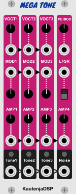

### Features

-   **Triple Pulse Waveform Generator** Three 8-bit pulse waves with _50%_ duty
    cycle and 10-bit frequency parameter
-   **Noise Generator** Generate either pitched white-noise based on the
    frequency of oscillator three, or static periodic noise at one of three
    shift frequencies: _N / 2048_, _N / 1024_, _N / 512_ where _N_ is the
    reference clock rate (which is something like _3579545Hz_).
-   **4-bit Amplifier** A 4-bit amplifier controls the output level of each
    oscillator with mixer sliders and CV inputs
-   **Channel Mixer:** Mix the voices together internally with hard clipping
    and aliasing.

See the [Manual][MegaTone] for more information about the features of this module.

<!-- ------------------------------------------------------------ -->
<!-- MARK: Jairasullator -->
<!-- ------------------------------------------------------------ -->

## Jairasullator

**Jairasullator** is an emulation of the [General Instrument AY-3-8910][GI_AY_3_8910]
audio processing unit. The AY-3-8910 features three pulse waveform generators
and a noise generator that is shared between the channels.

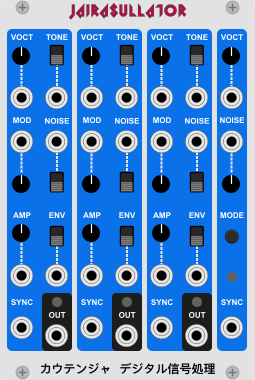

### Features

-   **Triple pulse wave generator:** Triple 12-bit pulse waves with duty cycle of _50%_
-   **Amplitude modulation:** Manual and CV control over the individual voice levels
-   **White noise:** Generate noise using the frequency knob for channel 3
-   **Tone/Noise control:** CV and switch to control tone and noise for each channel

See the [Manual][Jairasullator] for more information about the features of this module.

<!-- ------------------------------------------------------------ -->
<!-- MARK: Troglocillator -->
<!-- ------------------------------------------------------------ -->

## Troglocillator

**Troglocillator** is an emulation of the [Atari POKEY][AtariPOKEY] audio
processing unit. The POKEY produces four pulse waveforms, but contains a
variety of bonus controls, including extended frequency ranges, high-pass
filters, and noise generators / distortion effects.

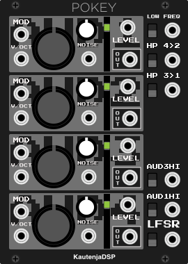

### Features

-   **Quad pulse wave generator:** Four pulse waves with 8-bit frequency value
    and _50%_ pulse width
-   **Low-frequency mode:** Change base clock of the chip from
    _64 KHz_ to _15 KHz_
-   **High-frequency mode:** Change base clock of channels 1 and 3 from
    _64 KHz_ to _1.79 MHz_
-   **High-pass filter:** High-pass filter channel 1 using channel 3 as a clock
    or high-pass channel 2 using channel 4 as a clock
-   **Linear Feedback Shift Register (LFSR):** old-school 8-bit randomness!
-   **Noise/Distortion generator:** generate per-channel pseudo-random numbers
    at 15 different frequencies as a distortion source
-   **Amplitude modulation:** 4-bit amplifier with linear amplitude modulation

See the [Manual][POKEY] for more information about the features of this module.

<!-- ------------------------------------------------------------ -->
<!-- MARK: SCC -->
<!-- ------------------------------------------------------------ -->

## Wave Creative Modulator _(Coming Soon!)_

**Wave Creative Modulator** is an emulation of the
[Konami Sound Creative Chip (SCC)][KonamiSCC] audio processing unit.

### Features

See the [Manual][WaveCreativeModulator] for more information about the features of this module.

<!-- ------------------------------------------------------------ -->
<!-- MARK: Grafx Turbillator -->
<!-- ------------------------------------------------------------ -->

## Grafx Turbillator _(Coming Soon!)_

**Grafx Turbillator** is an emulation of the [NEC TurboGrafx16][NECTurboGrafx16]
audio processing unit.

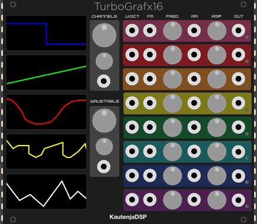

### Features

See the [Manual][GrafxTurbillator] for more information about the features of this module.

<!-- ------------------------------------------------------------ -->
<!-- MARK: Links -->
<!-- ------------------------------------------------------------ -->

<!-- Nintendo -->

[SunsoftFME7]: https://wiki.nesdev.com/w/index.php/Sunsoft_5B_audio
[Ricoh2A03]: https://wiki.nesdev.com/w/index.php/2A03
[KonamiVRC6]: https://wiki.nesdev.com/w/index.php/VRC6_audio
[Namco106]: https://wiki.nesdev.com/w/index.php?title=Namco_163_audio&redirect=no
[NES]: https://en.wikipedia.org/wiki/Nintendo_Entertainment_System
[SNES]: https://en.wikipedia.org/wiki/Super_Nintendo_Entertainment_System

<!-- Sega -->

[SegaMD]: https://en.wikipedia.org/wiki/Sega_Genesis
[SegaMasterSystem]: https://en.wikipedia.org/wiki/Master_System
[TI-SN76489]: https://en.wikipedia.org/wiki/Texas_Instruments_SN76489
[YM2612]: https://en.wikipedia.org/wiki/Yamaha_YM2612

<!-- Arcade -->

[AtariPOKEY]: https://en.wikipedia.org/wiki/POKEY
[GI_AY_3_8910]: http://map.grauw.nl/resources/sound/generalinstrument_ay-3-8910.pdf
[KonamiSCC]: http://bifi.msxnet.org/msxnet/tech/scc.html
[NECTurboGrafx16]:https://en.wikipedia.org/wiki/TurboGrafx-16

<!-- Manuals -->

[106]: https://github.com/Kautenja/PotatoChips/releases/latest/download/106.pdf
[2A03]: https://github.com/Kautenja/PotatoChips/releases/latest/download/2A03.pdf
[Gleeokillator]: https://github.com/Kautenja/PotatoChips/releases/latest/download/Gleeokillator.pdf
[GBS]: https://github.com/Kautenja/PotatoChips/releases/latest/download/GBS.pdf
[VRC6]: https://github.com/Kautenja/PotatoChips/releases/latest/download/VRC6.pdf
[S_SMP_ADSR]: https://github.com/Kautenja/PotatoChips/releases/latest/download/S_SMP_ADSR.pdf
[S_SMP_Gauss]: https://github.com/Kautenja/PotatoChips/releases/latest/download/S_SMP_Gauss.pdf
[S_SMP_Echo]: https://github.com/Kautenja/PotatoChips/releases/latest/download/S_SMP_Echo.pdf
[S_SMP_BRR]: https://github.com/Kautenja/PotatoChips/releases/latest/download/S_SMP_BRR.pdf
[S_SMP]: https://github.com/Kautenja/PotatoChips/releases/latest/download/S_SMP.pdf
[BossFight]: https://github.com/Kautenja/PotatoChips/releases/latest/download/BossFight.pdf
[MegaTone]: https://github.com/Kautenja/PotatoChips/releases/latest/download/MegaTone.pdf
[Jairasullator]: https://github.com/Kautenja/PotatoChips/releases/latest/download/Jairasullator.pdf
[POKEY]: https://github.com/Kautenja/PotatoChips/releases/latest/download/POKEY.pdf
[WaveCreativeModulator]: https://github.com/Kautenja/PotatoChips/releases/latest/download/WaveCreativeModulator.pdf
[GrafxTurbillator]: https://github.com/Kautenja/PotatoChips/releases/latest/download/GrafxTurbillator.pdf
