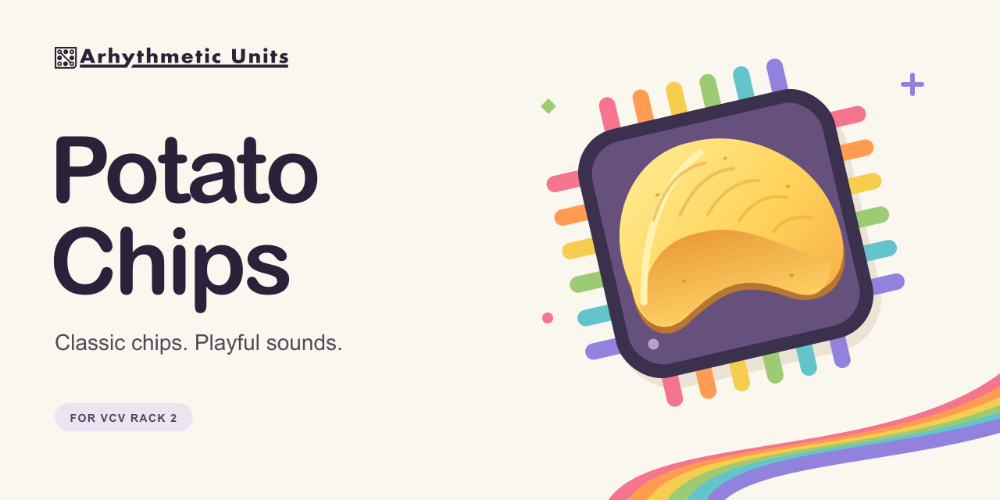

# Potato Chips

Potato Chips is an Arhythmetic Units plugin for VCV Rack 2, by Christian
Kauten and contributors. Build chiptune voices from classic sound-chip
oscillators, four-operator FM, wavetables, envelopes, and echo. The modules
support polyphonic Rack signals and expose chip controls as knobs and CV.

[VCV Library](https://library.vcvrack.com/KautenjaDSP-PotatoChips) ·
[GitHub releases](https://github.com/Kautenja/PotatoChips/releases) ·
[Source license: GPL-3.0-or-later](LICENSE) ·
[Artwork and dependency terms](LICENSING.md)

## Install

1.  Install [VCV Rack 2.4 or newer](https://vcvrack.com/) for your platform.
2.  Sign in to the [VCV Library][library] and add Potato Chips to your account.
3.  Sign in through Rack's **Library** menu, choose **Update all** when
    available, and restart Rack after the download.
4.  Right-click empty rack space and search for a module such as
    **Staircase 2A03** or **Voice 2612**.

The Library may still show **KautenjaDSP Potato Chips**. The saved plugin
identifier remains `KautenjaDSP-PotatoChips`, so the brand change does not
rename existing patches. Library builds, GitHub releases, and this checkout
can be at different versions. The current source manifest is `2.1.0`;
changes under development are recorded in the [changelog](CHANGELOG.md).

For a manually downloaded build, follow Rack's
[plugin installation instructions][installing] and select a `.vcvplugin`
matching your operating system, CPU architecture, and Rack major version.
Use the Library or an actual release asset; the source ZIP is not a plugin.

## Make A First Sound

1.  Add **Staircase 2A03** and a VCV **Audio** module. Select your audio
    driver/device and begin with your monitoring level low.
2.  Connect Staircase 2A03' leftmost output, **Pulse 1 Audio**, to Audio's
    **To device 1** input. It is a free-running oscillator; no gate is needed.
3.  Leave Pulse 1's frequency at its default C4, FM at zero, and volume at
    10. Turn its frequency and duty-cycle controls to hear the change.
4.  For played notes, add VCV **MIDI-CV**, select your MIDI device, and
    connect **V/OCT** to Pulse 1's **V/Oct** input. Use a separate envelope
    and VCA if you want notes to become silent when the keys are released.

The [Staircase 2A03 manual][InfiniteStairs] explains its other voices,
voltage ranges, and output mixing. Patching its first output separately
keeps that voice out of the normalled mix at the next output.

## Modules

The released inventory represented by this source contains 14 sound modules
and two informational blank panels. Module manuals use the established PDF
asset names below. These links target the latest GitHub release, which may
lag the checkout; editable sources are in [manual/](manual/).

| Module | Chip / Source | Use | Manual |
| --- | --- | --- | --- |
| Facets | Mutable Instruments Edges | Digital waveforms and stepped noise | [PDF](https://github.com/Kautenja/PotatoChips/releases/latest/download/Blocks.pdf) |
| Staircase 2A03 | Ricoh 2A03 | NES pulse, triangle, and noise voices | [PDF](https://github.com/Kautenja/PotatoChips/releases/latest/download/InfiniteStairs.pdf) |
| Ramp VRC6 | Konami VRC6 | Pulse and quantized saw voices | [PDF](https://github.com/Kautenja/PotatoChips/releases/latest/download/StepSaw.pdf) |
| Pulse FME-7 | Sunsoft FME-7 | Three pulse voices | [PDF](https://github.com/Kautenja/PotatoChips/releases/latest/download/Pulses.pdf) |
| Trio AY | General Instrument AY-3-8910 | Tone, noise, and envelope synthesis | [PDF](https://github.com/Kautenja/PotatoChips/releases/latest/download/Jairasullator.pdf) |
| Polynomial | Atari POKEY | Pulse voices, noise, and distortion modes | [PDF](https://github.com/Kautenja/PotatoChips/releases/latest/download/PotKeys.pdf) |
| Tone 76489 | Texas Instruments SN76489 | Pulse voices and periodic/white noise | [PDF](https://github.com/Kautenja/PotatoChips/releases/latest/download/MegaTone.pdf) |
| Voice 2612 | Yamaha YM2612 | Four-operator FM voice | [PDF](https://github.com/Kautenja/PotatoChips/releases/latest/download/BossFight.pdf) |
| Operator 2612 | Yamaha YM2612 | Single FM operator with external modulation | [PDF](https://github.com/Kautenja/PotatoChips/releases/latest/download/MiniBoss.pdf) |
| Octal 163 | Namco 163 | Eight voices with editable wavetables | [PDF](https://github.com/Kautenja/PotatoChips/releases/latest/download/NameCorpOctalWaveGenerator.pdf) |
| Pocket APU | Game Boy sound system | Pulse, wavetable, and noise voices | [PDF](https://github.com/Kautenja/PotatoChips/releases/latest/download/PalletTownWavesSystem.pdf) |
| Contour | Sony S-DSP | Two envelope generators | [PDF](https://github.com/Kautenja/PotatoChips/releases/latest/download/SuperADSR.pdf) |
| Echo | Sony S-DSP | Stereo echo with an eight-tap FIR filter | [PDF](https://github.com/Kautenja/PotatoChips/releases/latest/download/SuperEcho.pdf) |
| Gaussian | Sony S-DSP | Two Gaussian interpolation filters/VCAs | [PDF](https://github.com/Kautenja/PotatoChips/releases/latest/download/SuperVCA.pdf) |

The **Contour 2612** illustrates an envelope;
the **Silicon S-SMP** illustrates the chip. Both are passive panels.

## Names And Panel Themes

Choose **View > Use dark panels if available** in Rack 2.4 or newer. All
16 modules follow this setting immediately, including browser previews.
The module's sound, parameters and saved state are independent of this
setting. Older Rack versions are unsupported; upgrade Rack before installing
this build (pre-2.4 clients do not enforce the minimum-version download rule).

Existing patches and presets use unchanged module identifiers. Manuals keep
their established download filenames. Browser descriptions and keywords
retain the former names; the following table also provides a direct lookup.
These names and panels describe the checkout; published releases may lag it.

| Former Name | Current Name |
| --- | --- |
| Blocks | Facets |
| Mini Boss | Operator 2612 |
| Pallet Town Waves System | Pocket APU |
| Infinite Stairs | Staircase 2A03 |
| Step Saw | Ramp VRC6 |
| Pulses | Pulse FME-7 |
| Jairasullator | Trio AY |
| Pot Keys | Polynomial |
| Mega Tone | Tone 76489 |
| Boss Fight | Voice 2612 |
| Name Corp Octal Wave Generator | Octal 163 |
| Super ADSR | Contour |
| Super Echo | Echo |
| Super VCA | Gaussian |
| Boss Fight Envelope Generator (Blank) | Contour 2612 |
| S-SMP Blank | Silicon S-SMP |

## Patch Ideas

-   Combine Staircase 2A03' pulse and triangle voices for a melody and bass,
    then add its noise voice for percussion.
-   Patch Operator 2612 into its FM input, starting with a small modulation
    depth, or use Voice 2612's algorithms for layered FM sounds.
-   Send a synth voice through Gaussian and Echo; modulate the echo
    filter coefficients to change the repeats' tone.

[Debug patches](patches/debug/) and [older examples](patches/misc/) are
contributor fixtures. Some were saved in Rack 1 or require additional plugins;
check their contents and select your own audio/MIDI devices when opening them.
The first-sound steps above need only Potato Chips and VCV's built-in modules.

## Support And Development

Read [SUPPORT.md](SUPPORT.md) for troubleshooting and useful bug reports.
[CONTRIBUTING.md](CONTRIBUTING.md) covers setup, the source map, builds,
tests, manual assets, and release preparation. [Specifications](specs/README.md)
describe planned work; a spec is not an implemented feature or release date.

The source, artwork, and dependencies have distinct terms. See
[LICENSING.md](LICENSING.md) and the
[component inventory](docs/licenses/THIRD-PARTY.txt), including its recorded
historical provenance gaps. Source API documentation lives in code comments.

[library]: https://library.vcvrack.com/KautenjaDSP-PotatoChips
[installing]: https://vcvrack.com/manual/Installing#installing-plugins-not-available-on-the-vcv-library
[InfiniteStairs]: https://github.com/Kautenja/PotatoChips/releases/latest/download/InfiniteStairs.pdf
