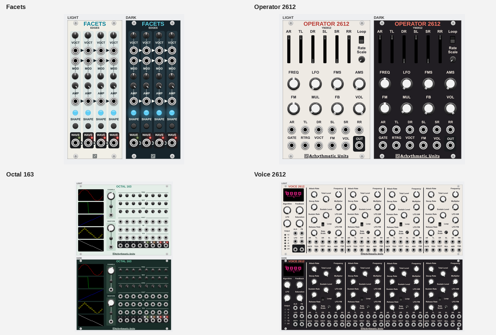
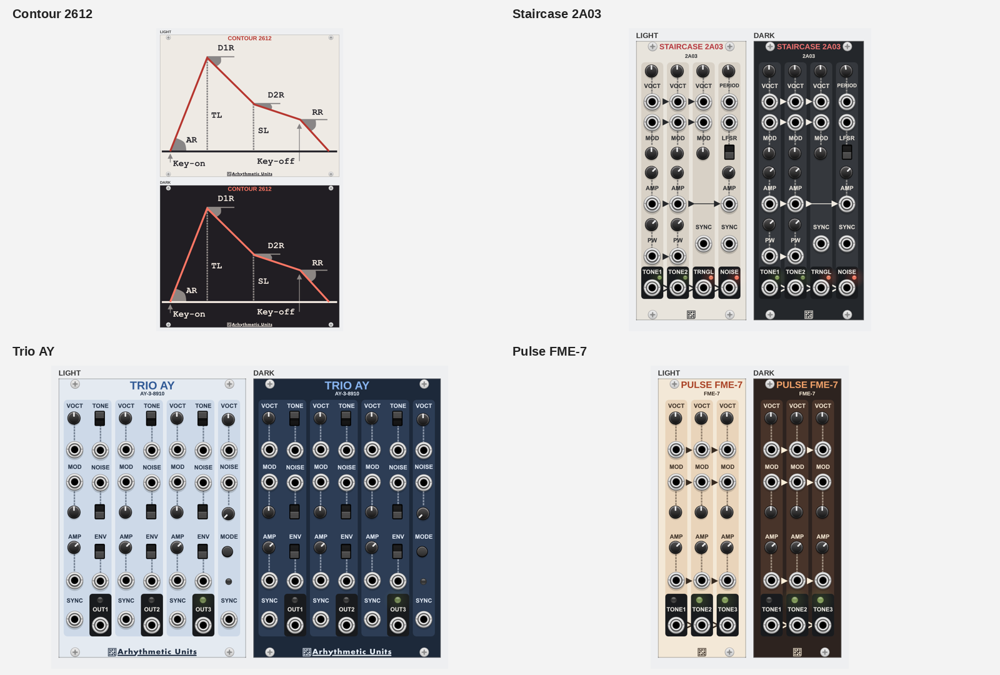
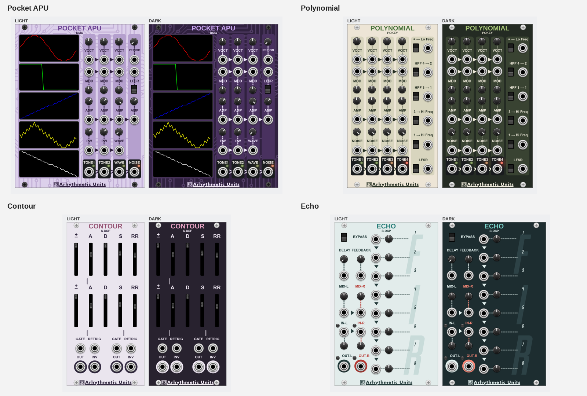
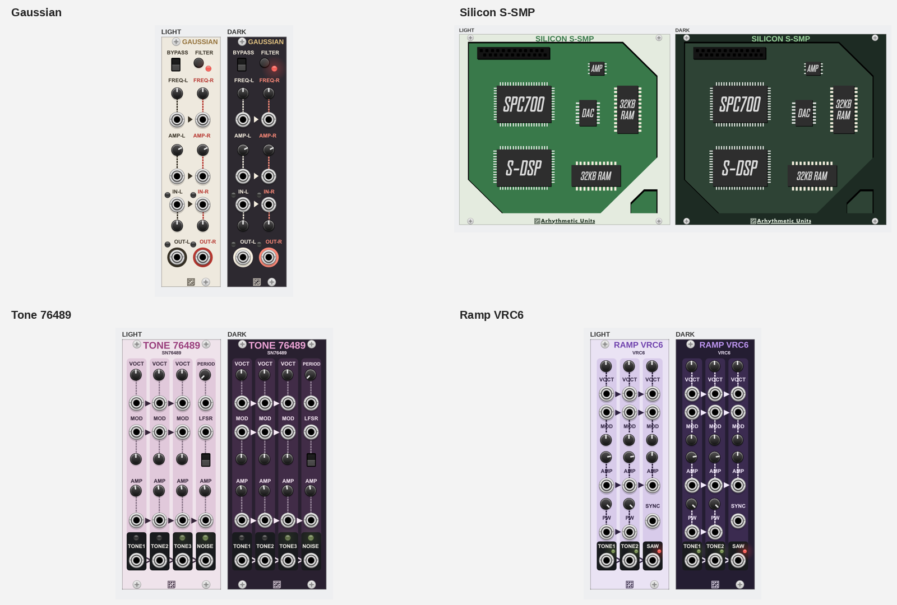

# Native Panel Preview Gallery

These are native Rack renders of the exact SVG candidates for all 16 modules.
Each pair shows light and dark palettes with unchanged controls. See the
[handoff](README.md) for implementation rules and the movement register.

## Full-Size Panels

| Module | Exact Native Pair | ImageGen Exploration |
| --- | --- | --- |
| Facets | [Native pair](previews/Blocks-pair.png) | [Concept](concepts/Blocks.png) |
| Operator 2612 | [Native pair](previews/MiniBoss-pair.png) | [Concept](concepts/MiniBoss.png) |
| Pocket APU | [Native pair](previews/PalletTownWavesSystem-pair.png) | [Concept](concepts/PalletTownWavesSystem.png) |
| Staircase 2A03 | [Native pair](previews/InfiniteStairs-pair.png) | [Concept](concepts/InfiniteStairs.png) |
| Ramp VRC6 | [Native pair](previews/StepSaw-pair.png) | [Concept](concepts/StepSaw.png) |
| Pulse FME-7 | [Native pair](previews/Pulses-pair.png) | [Concept](concepts/Pulses.png) |
| Trio AY | [Native pair](previews/Jairasullator-pair.png) | [Concept](concepts/Jairasullator.png) |
| Polynomial | [Native pair](previews/PotKeys-pair.png) | [Concept](concepts/PotKeys.png) |
| Tone 76489 | [Native pair](previews/MegaTone-pair.png) | [Concept](concepts/MegaTone.png) |
| Voice 2612 | [Native pair](previews/BossFight-pair.png) | [Concept](concepts/BossFight.png) |
| Octal 163 | [Native pair](previews/NameCorpOctalWaveGenerator-pair.png) | [Concept](concepts/NameCorpOctalWaveGenerator.png) |
| Contour | [Native pair](previews/SuperADSR-pair.png) | [Concept](concepts/SuperADSR.png) |
| Echo | [Native pair](previews/SuperEcho-pair.png) | [Concept](concepts/SuperEcho.png) |
| Gaussian | [Native pair](previews/SuperVCA-pair.png) | [Concept](concepts/SuperVCA.png) |
| Contour 2612 | [Native pair](previews/2612_Blank1-pair.png) | [Concept](concepts/2612_Blank1.png) |
| Silicon S-SMP | [Native pair](previews/Sony_S_SMP_Blank1-pair.png) | [Concept](concepts/Sony_S_SMP_Blank1.png) |
