# Integrated Native Panels

Actual production widgets with native light/dark panels, screws and ports.
All 606 captured control/display bounds match the approved layout.
Both themes, previews, zoom, dimming and context restoration were checked.
See [implementation evidence](implementation.json) and the owning specs.

## Facets

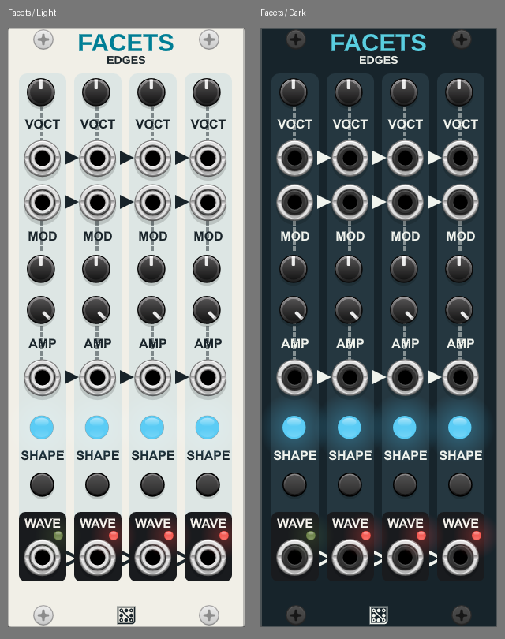

## Operator 2612

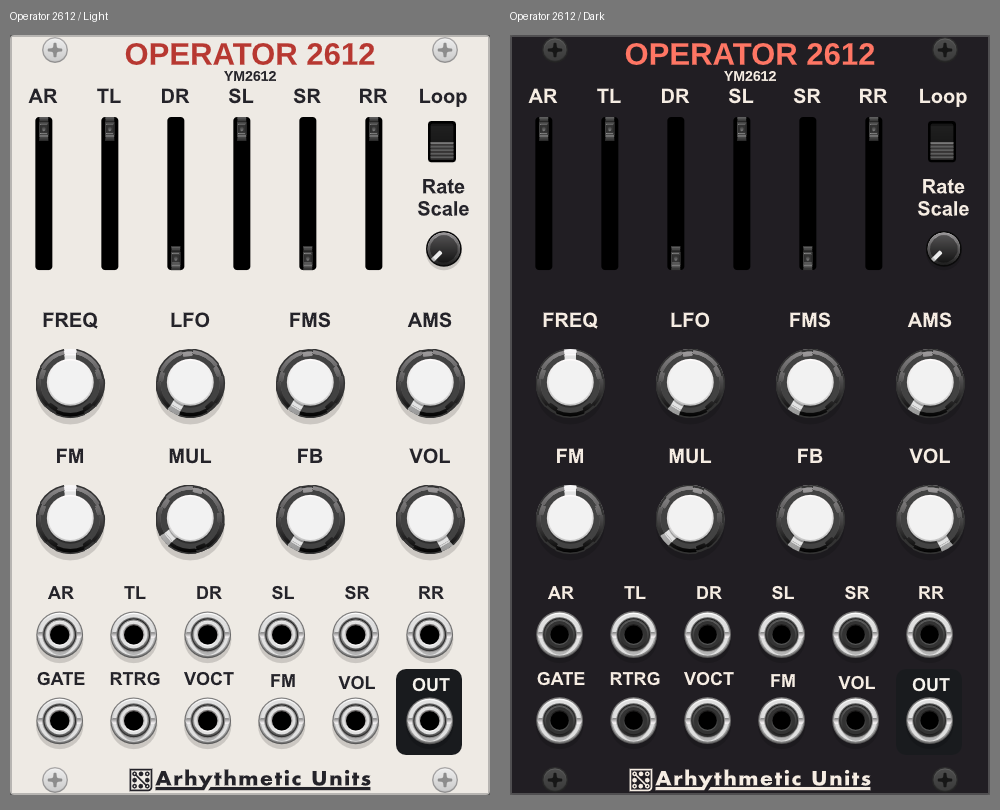

## Octal 163

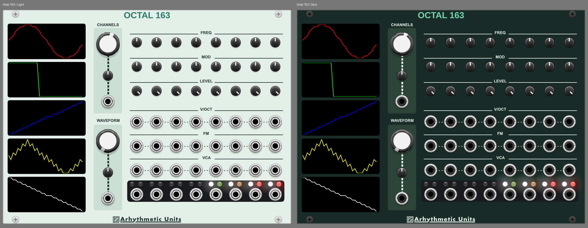

## Voice 2612

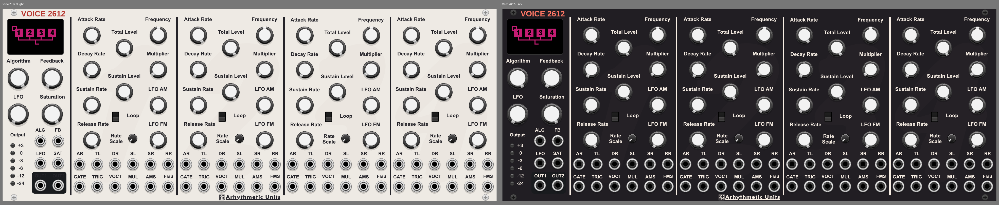

## Contour 2612

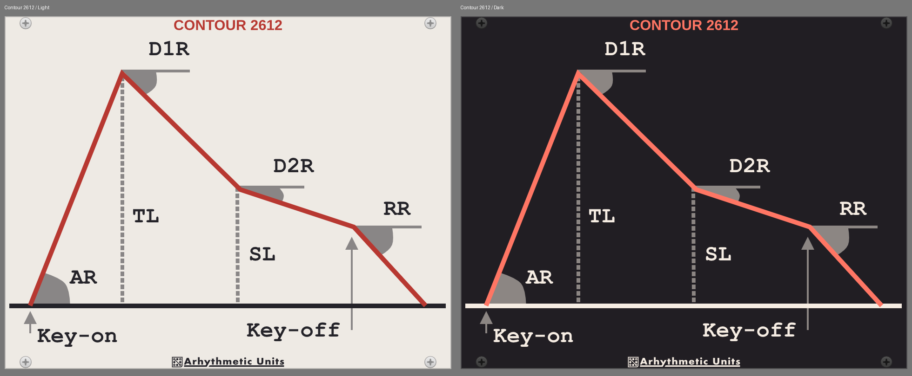

## Staircase 2A03

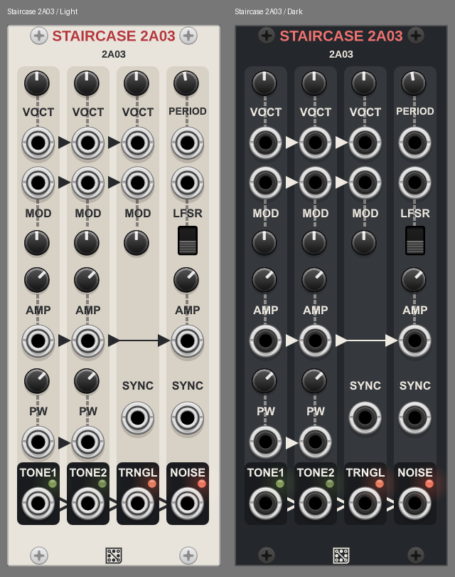

## Trio AY

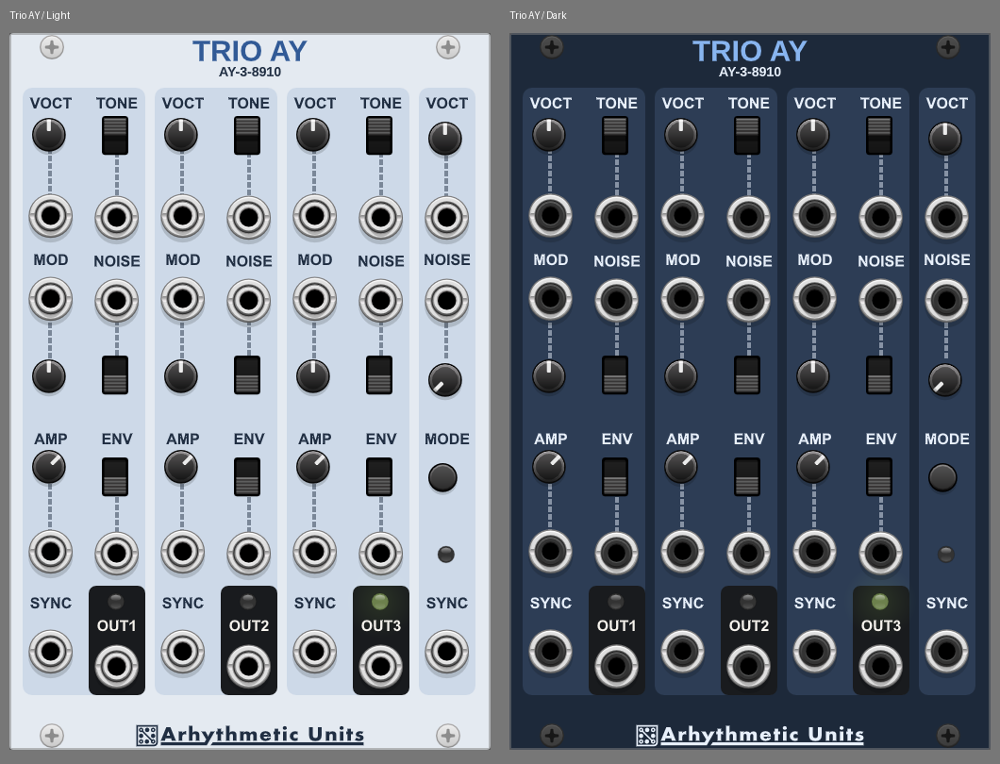

## Pulse FME-7

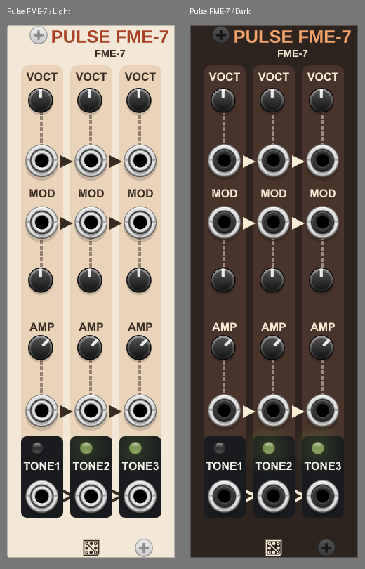

## Pocket APU

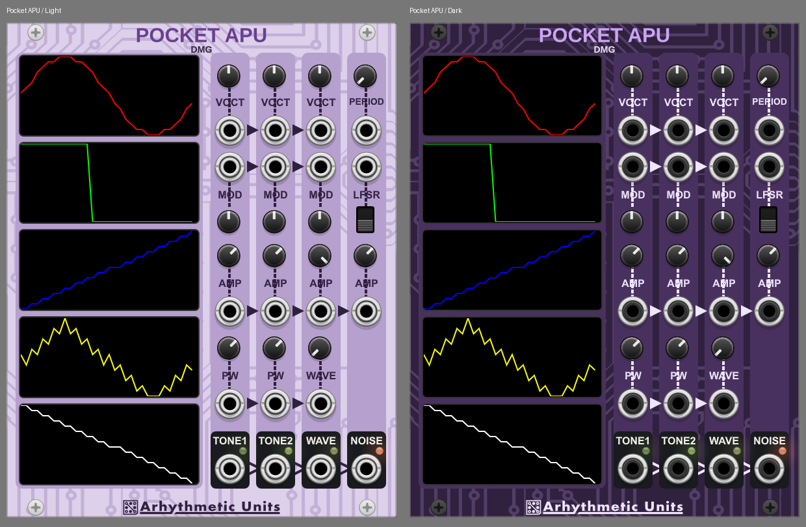

## Polynomial

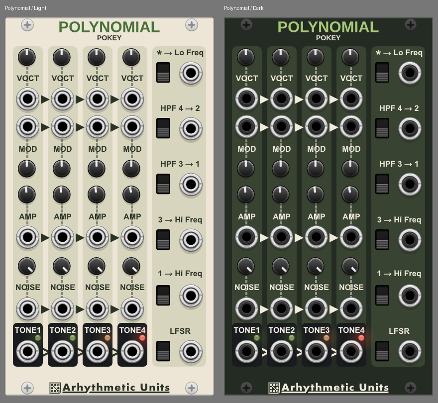

## Contour

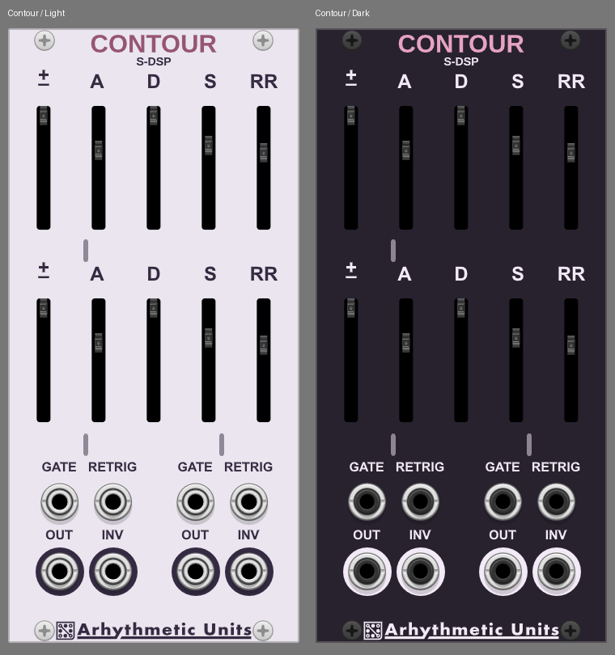

## Echo

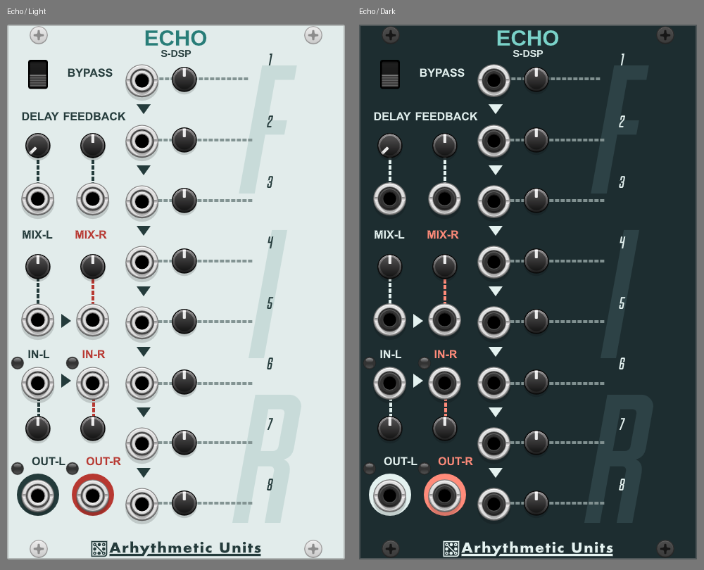

## Gaussian

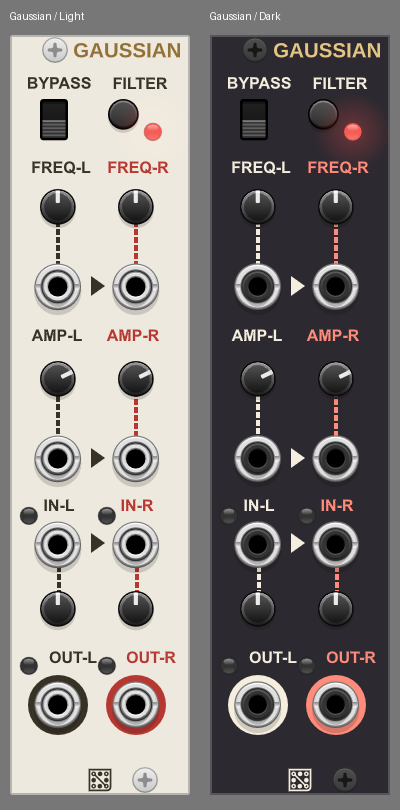

## Silicon S-SMP

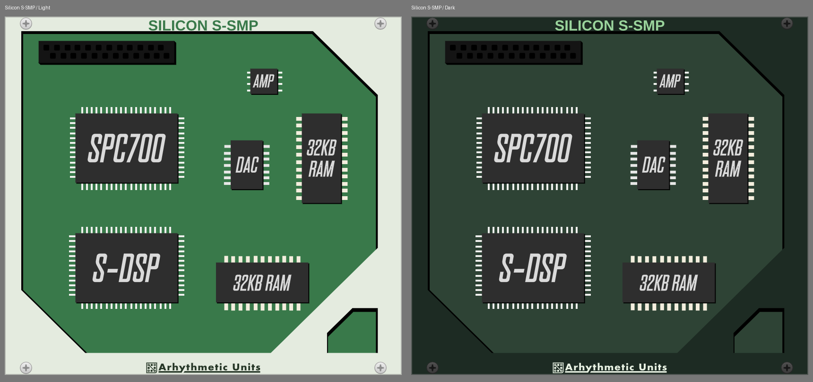

## Tone 76489

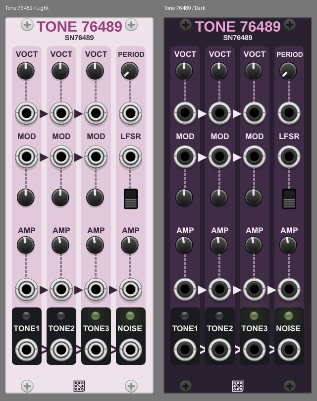

## Ramp VRC6

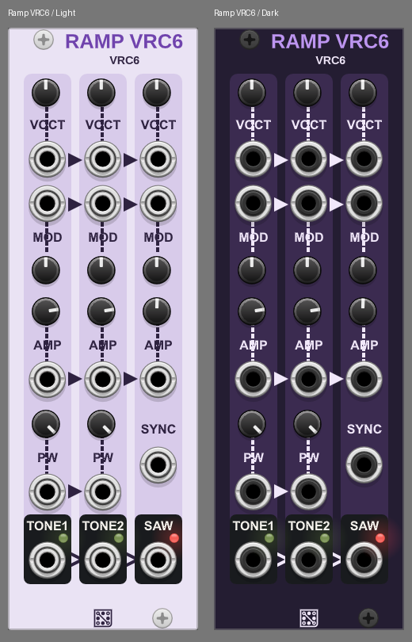
